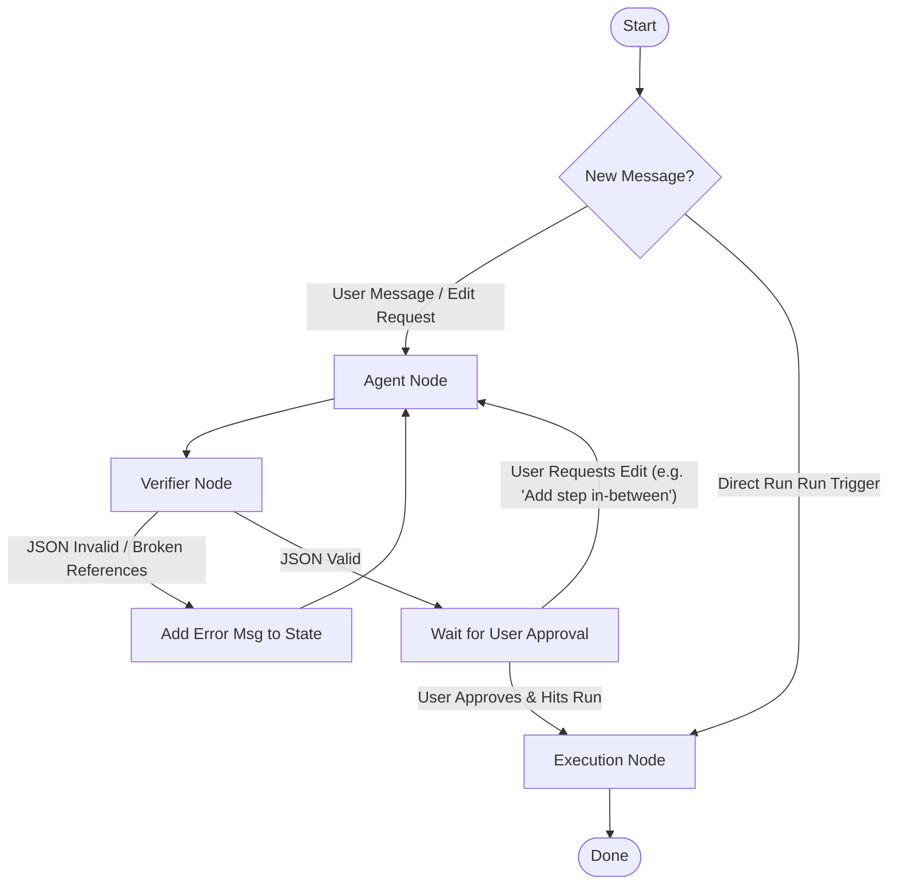

# Designing a Streaming & Interactive Workflow Agent

This guide outlines how to build an interactive, streaming AI agent that designs, validates, and modifies multi-step tool workflows (using Composio meta-tools) and streams thoughts and actions to a frontend in real-time.

---

## 1. Core Architecture & Separation of Concerns

To keep the application fast, token-efficient, and reliable, we decouple the system into three layers:
1. **AI Design & Modification (LangGraph Agent)**: High intelligence. Discusses requirements, searches tool directories, retrieves schemas, and organizes workflow structures.
2. **Deterministic Verification (State Graph Node)**: Fast Python code. Validates that the workflow JSON is structurally sound and that step references are correct.
3. **Execution Engine (Deterministic Python SDK)**: Instantly runs the workflow actions in Python via `comp.tools.execute`, resolving output placeholders (`{{step_N.field}}`) on-the-fly with **$0 token cost**.

---

## 2. LangGraph State Graph Design

To handle the loop-back validation, interactive editing, and step insertions, we design a custom state graph using LangGraph.

### State Definition
We define the graph state to hold the dialogue, the workflow structure, and validation feedback:
```python
from typing import TypedDict, Annotated, List, Dict, Any
from langchain_core.messages import BaseMessage
import operator

class WorkflowState(TypedDict):
    messages: Annotated[List[BaseMessage], operator.add]  # Appends chat history
    workflow: Dict[str, Any]                              # Current workflow schema dict
    validation_error: str                                 # Validation error feedback (if any)
    is_valid: bool                                        # Flag indicating if JSON is approved
```

### The State Graph
Below is the visual structure of the LangGraph state graph.



### Node Explanations

1. **`AgentNode`**:
   - Compiles the system instructions and passes the **current workflow** state to the LLM (as context or a system message) so the agent knows what steps currently exist.
   - Bind tools: `COMPOSIO_SEARCH_TOOLS`, `COMPOSIO_GET_TOOL_SCHEMAS`, and the custom `set_workflow` tool.
   - If `validation_error` exists in the state, the agent is prompted with: *"The verifier found this issue: [validation_error]. Fix the workflow and call set_workflow again."*

2. **`VerifierNode` (Loop-Back Step)**:
   - A pure Python node (no LLM required) that intercepts the workflow dictionary set by the agent.
   - It performs programmatic checks:
     - **Structure**: Verifies required keys are present (`name`, `description`, `steps` with `tool_name` and `fields`).
     - **Placeholders**: Checks if any parameter values reference an out-of-bounds step (e.g., Step 2 trying to use `{{step_3}}` before Step 3 runs).
     - **Types**: Coerces or highlights values that don't match parameter data types (e.g. string passed to boolean).
   - If verification fails, it updates `validation_error = "Error details..."` and routes back to the agent.
   - If verification succeeds, it clears `validation_error` and sets `is_valid = True`.

---

## 3. Handling In-Between Step Insertions

When the user asks to insert a step in the middle of a workflow (e.g., *"Insert a step after Step 1 to look up Google Sheets"*):

1. **State Preservation**: Because the current workflow is stored in the graph state (`state["workflow"]`), the agent receives the existing structure.
2. **Step Re-indexing**:
   - The agent calls `COMPOSIO_SEARCH_TOOLS` and `COMPOSIO_GET_TOOL_SCHEMAS` for the new Google Sheets step.
   - It inserts the new step into the array: `steps = [step_1, google_sheets_step, step_2_old, ...]`.
3. **Placeholder Shifting**:
   - The agent updates downstream step placeholders. For example, if the old Step 2 (now Step 3) referenced `{{step_1}}`, that remains correct. But if it referenced a variable from a step that moved, the indices must be shifted appropriately (`{{step_2}}` becomes `{{step_3}}`).
   - The agent calls `set_workflow` with this reconstructed list.
4. **Validation Check**: The `VerifierNode` runs automatically to ensure the shifted step indexes are structurally sound.

---

## 4. Composio Meta-Tools Explained

The agent is compiled with the following meta-tools from the Composio SDK:

| Tool Name | Purpose | Example Input | Typical Output |
| :--- | :--- | :--- | :--- |
| **`COMPOSIO_SEARCH_TOOLS`** | Searches the global directory for action/tool slugs matching a query. | `{"query": "gmail send email"}` | `[{"slug": "GMAIL_SEND_EMAIL", "description": "Send an email..."}]` |
| **`COMPOSIO_GET_TOOL_SCHEMAS`** | Retrieves parameter names, types, and descriptions for an action slug. | `{"slug": "GMAIL_SEND_EMAIL"}` | JSON Schema details for fields like `recipient_email`, `subject`, `body`. |
| **`COMPOSIO_MANAGE_CONNECTIONS`**| Fetches connection details, auth links, and statuses. | `{"toolkit_slug": "gmail"}` | Connection URLs or status details for the Oauth flow. |

> [!IMPORTANT]
> Keep `COMPOSIO_MULTI_EXECUTE_TOOL` out of the designer agent. We want the agent to design and output steps, not run them. Execution is handled safely by our python runtime.

---

## 5. Implementation Roadmap & Files to Create

To implement this with streaming capabilities on the frontend, create the following structures:

### File 1: `workflows/schema.py`
Define the structured schemas for the workflows and validation.

```python
from pydantic import BaseModel, Field
from typing import List, Optional, Any

class WorkflowField(BaseModel):
    name: str = Field(description="Exact parameter name from Composio schema")
    type: str = Field(description="string, boolean, integer, or number")
    description: str = Field(description="Friendly description of what this parameter does")
    value: Any = Field(default="", description="Pre-filled value, or placeholder like {{step_N.key}}")

class WorkflowStep(BaseModel):
    tool_name: str = Field(description="Exact tool action slug (e.g. GMAIL_SEND_EMAIL)")
    step_description: str = Field(description="Short sentence explaining what this step does")
    fields: List[WorkflowField]

class WorkflowStructure(BaseModel):
    name: str
    description: str
    steps: List[WorkflowStep]
```

### File 2: `workflows/agent_graph.py`
Define your LangGraph state and nodes.

```python
from langgraph.graph import StateGraph, END
from langchain_openai import ChatOpenAI
from workflows.schema import WorkflowStructure
from src.config import settings
import json

# Define Node: Agent
def agent_node(state: WorkflowState):
    messages = state["messages"]
    workflow = state.get("workflow", {})
    err = state.get("validation_error", "")
    
    # Enrich system prompt with current workflow status and errors
    prompt = f"Current Workflow Structure: {json.dumps(workflow)}\n"
    if err:
        prompt += f"\n[CRITICAL VERIFICATION ERROR]: {err}\nPlease fix the steps."
        
    # Execute agent reaction loop
    # ...
    return {"messages": [response_message]}

# Define Node: Verifier
def verifier_node(state: WorkflowState):
    workflow = state.get("workflow", {})
    steps = workflow.get("steps", [])
    
    for idx, step in enumerate(steps):
        # 1. Check if toolkits are active
        # 2. Check for out-of-bounds placeholders (e.g., {{step_N}} where N > idx)
        for field in step.get("fields", []):
            val = str(field.get("value", ""))
            if "{{" in val:
                # Extract step number from placeholder
                import re
                matches = re.findall(r"step_(\d+)", val)
                for m in matches:
                    ref_idx = int(m)
                    if ref_idx >= idx + 1:  # 1-based index reference
                        return {
                            "validation_error": f"Step {idx+1} ({step['tool_name']}) references Step {ref_idx}, which runs later. Downstream steps cannot be referenced upstream.",
                            "is_valid": False
                        }
                        
    return {"validation_error": "", "is_valid": True}

# Compile Graph
workflow = StateGraph(WorkflowState)
workflow.add_node("agent", agent_node)
workflow.add_node("verifier", verifier_node)

workflow.set_entry_point("agent")
workflow.add_edge("agent", "verifier")

# Route based on validation
def route_after_verification(state: WorkflowState):
    if state.get("is_valid"):
        return END
    return "agent"

workflow.add_conditional_edges("verifier", route_after_verification)
graph = workflow.compile()
```

### File 3: `backend/stream_server.py`
Create a FastAPI server to stream thoughts, tool calls, and outputs using **Server-Sent Events (SSE)**.

```python
from fastapi import FastAPI
from fastapi.responses import StreamingResponse
from workflows.agent_graph import graph
import json
import asyncio

app = FastAPI()

@app.get("/api/chat/stream")
async def stream_chat(user_message: str, thread_id: str):
    async def event_generator():
        config = {"configurable": {"thread_id": thread_id}}
        inputs = {"messages": [{"role": "user", "content": user_message}]}
        
        async for event in graph.astream(inputs, config=config, stream_mode="updates"):
            # Check for node updates
            if "agent" in event:
                node_data = event["agent"]
                # Stream thought or tool call payload
                yield f"data: {json.dumps({'type': 'thought', 'content': 'Agent is processing...'})}\n\n"
            elif "verifier" in event:
                node_data = event["verifier"]
                if node_data.get("validation_error"):
                    yield f"data: {json.dumps({'type': 'error', 'content': node_data['validation_error']})}\n\n"
                else:
                    yield f"data: {json.dumps({'type': 'status', 'content': 'Structure validated successfully'})}\n\n"
                    
    return StreamingResponse(event_generator(), media_type="text/event-stream")
```

---

## 6. Premium Frontend Suggestions (SSE Parser)

On the client side (e.g., React or Streamlit), parse the EventStream to show the agent's progress dynamically:

1. **Vibrant Thoughts Display**: Render agent reasoning chunks in real-time inside a glowing thoughts container.
2. **Tool Call Badges**: Render badges like `[Tool Search: Slack]` while the agent queries Composio schemas.
3. **Step Canvas Animation**: Show cards matching the workflow updating live as `set_workflow` triggers, using CSS transitions or animations.

Enforces type safety and schema structure via Pydantic.
Deterministic checks run in pure Python to prevent invalid workflow configurations from reaching the UI database.
Auto-corrects errors internally before showing the results to the user.
Production Recommendations:
Add Unit Tests: Ensure you have tests for the regex check and Pydantic validation (in 

schema.py
) using mock workflows.
Error Boundaries: While the verifier will catch structural anomalies, always ensure runtime exceptions during Composio tool execution on the server side are caught and returned gracefully as shown in your current execution blocks.